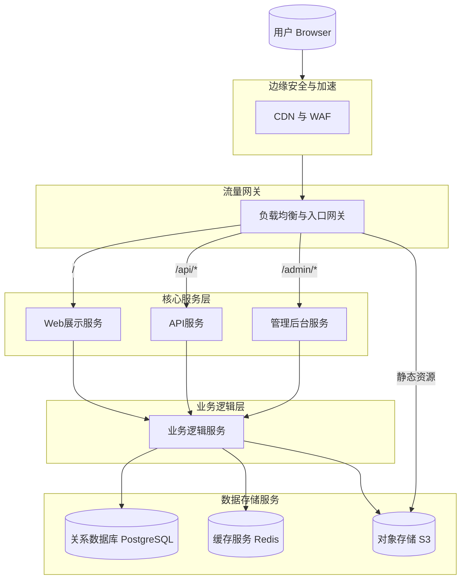

```mermaid
flowchart TD
    User[("用户 Browser")]

    subgraph Edge [边缘安全与加速]
        CDN[CDN 与 WAF]
    end

    subgraph Gateway [流量网关]
        LB[负载均衡与入口网关]
    end

    subgraph Services [核心服务层]
        Web[Web展示服务]
        API[API服务]
        Admin[管理后台服务]
    end

    subgraph Logic [业务逻辑层]
        Core[业务逻辑服务]
    end

    subgraph DataLayer [数据存储服务]
        RDS[(关系数据库 PostgreSQL)]
        Cache[(缓存服务 Redis)]
        Blob[(对象存储 S3)]
    end

    User --> Edge --> LB

    LB -->|/| Web
    LB -->|/api/*| API
    LB -->|/admin/*| Admin
    LB -->|静态资源| Blob

    Web --> Core
    API --> Core
    Admin --> Core

    Core --> RDS
    Core --> Cache
    Core --> Blob
```
